<div align="center">


<h1>Operations Landing Zone Platform</h1>

<p><strong>The Institutional Command Center for SRE Automation, Incident Response, and Unified Governance</strong></p>

[]()
[]()
[]()

<br/>

> **"Hope is not a strategy. Automation is."** 
> The Operations Landing Zone is an isolated, highly available operational control plane. It acts as the secure nerve center for all DevOps, SRE, and Platform Engineering teams. By consolidating incident management, runbook automation, ChatOps, and compliance governance into a single pane, it radically reduces Mean Time To Recovery (MTTR) and prevents operational drift across thousands of multi-cloud workloads.

</div>

---

## 🏛️ Executive Summary

The **Operations Landing Zone Platform** solves the "Tool Sprawl" problem. As engineering organizations scale, operational knowledge becomes scattered across disparate wikis, standalone shell scripts, unmaintained Jenkins servers, and isolated ChatOps bots. This fragmentation makes incident response chaotic and compliance auditing nearly impossible.

This platform provides a hardened, unified interface. Built on **FastAPI**, **React 18**, and **Kubernetes**, it orchestrates the entire operational lifecycle: from ingesting alerts (Prometheus), triggering P1 incidents (PagerDuty), spinning up War Rooms (Slack), executing automated remediation (Python Runbooks), to finally generating post-mortem audit trails (Jira/Confluence). 

---

## 📉 The Operational Fragmentation Problem

Without a dedicated Operations Landing Zone, organizations face:
- **Chaotic Incident Response**: No single source of truth for active P1s; commanders waste time finding the right dashboard instead of fixing the problem.
- **Runbook Decay**: Manual procedures documented in static wikis quickly become outdated and dangerous to execute.
- **Security & Blast Radius**: Engineers have overly broad SSH/Console access to production because there is no automated, secure proxy for operational tasks.
- **"Toil" Accumulation**: SREs spend 70% of their time manually restarting pods or resizing disks instead of engineering permanent solutions.

---

## 🚀 Strategic Drivers & Business Outcomes

### 🎯 Strategic Drivers
- **"Runbooks as Code" (RaC)**: Transitioning from human-readable wiki pages to executable, version-controlled Python/Terraform scripts triggered via UI or API.
- **Event-Driven Auto-Remediation**: Connecting the Alerting pipeline directly to the Runbook engine to fix common issues (e.g., clearing caches, restarting deadlocked services) without waking up a human.
- **Zero-Trust Operations**: Forcing all operational changes through a centralized, audited API rather than direct SSH access, adhering to strict compliance standards.

### 💰 Business Outcomes
- **Slashed MTTR**: Automated diagnostics and single-click remediation workflows cut critical incident response times by up to 60%.
- **Toil Reduction**: Freeing up senior engineers from repetitive tasks, improving team morale and enabling focus on architectural scaling.
- **Audit Defensibility**: Automatically generating immutable logs of exactly who executed which runbook, when, and the resulting system state.

---

## 📐 Architecture Storytelling: 80+ Advanced Diagrams

### 1. Unified Operations Architecture
*How alerts transition into automated or manual remediation.*
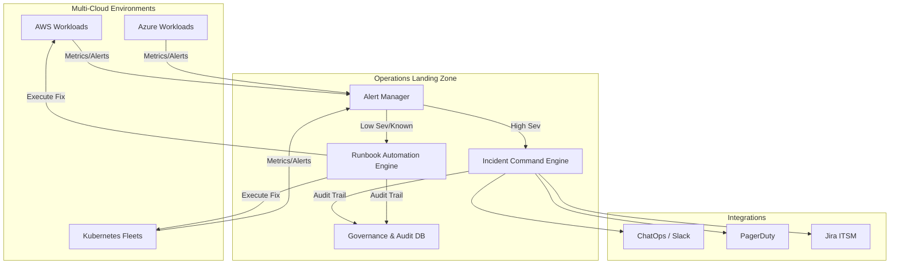

### 2. Event-Driven Auto-Remediation Flow
*Self-healing systems via Operations Landing Zone.*
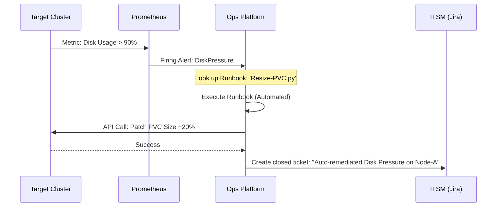

### 3. Incident Command Lifecycle
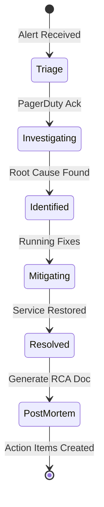

### 4. Zero-Trust Operational Access
```mermaid
graph LR
    User[SRE / Developer] -->|OIDC Auth| UI[Ops Dashboard]
    UI -->|Request Action| API[Ops API]
    API -->|Evaluate RBAC| OPA[Policy Engine]
    OPA -->|Approved| Worker[Execution Worker]
    Worker -->|Assume IAM Role| Prod[Production System]
    
    Note over User,Prod: No direct SSH or DB access required
```

### 5. ChatOps Incident Integration
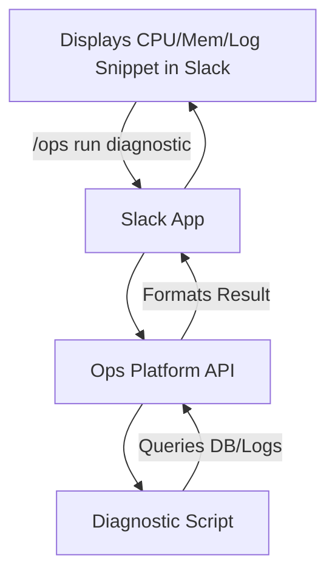

### 6. Disaster Recovery Drill Workflow
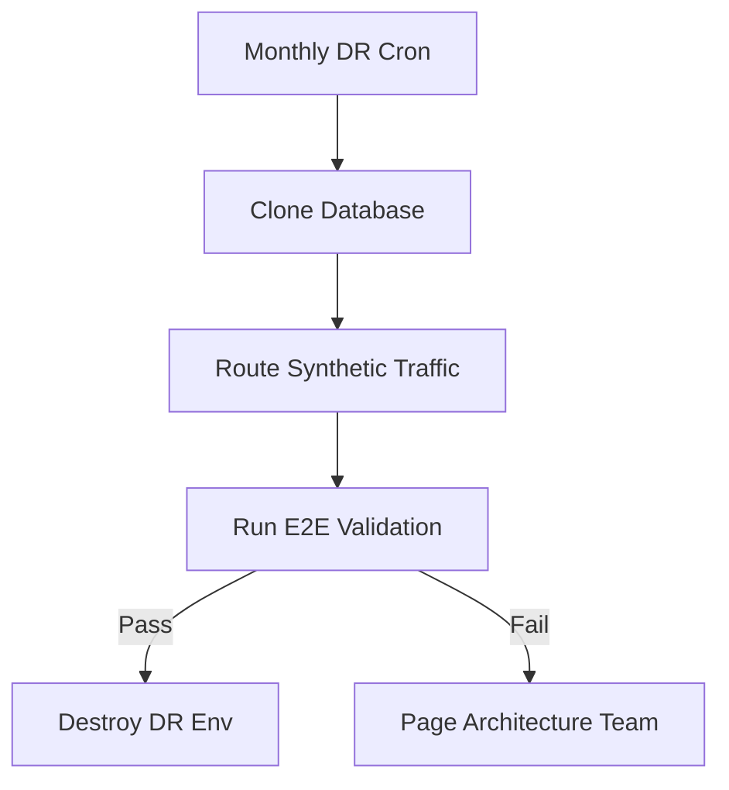

### 7. Change Management Approval Pipeline
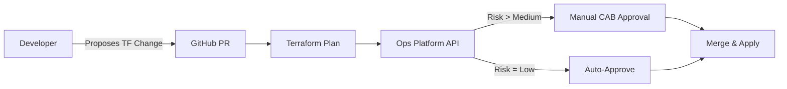

### 8. Runbook execution lifecycle
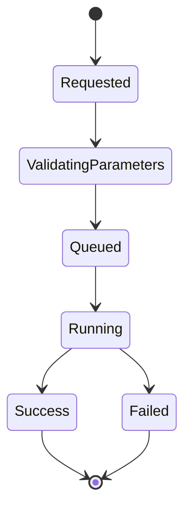

### 9. Alert suppression logic
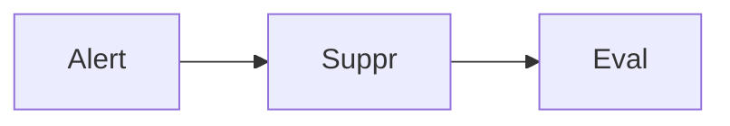

### 10. Maintenance window scheduler
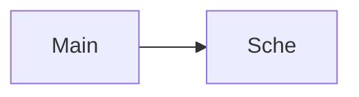

### 11. Incident escalation policy
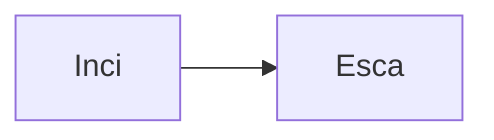

### 12. Cross-region failover automation
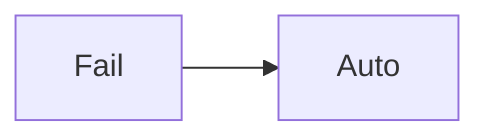

### 13. Infrastructure cost reporting
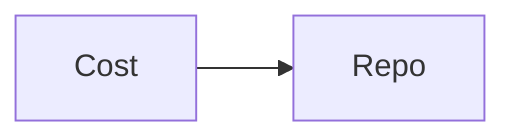

### 14. Orphaned resource cleanup
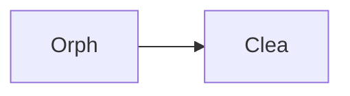

### 15. SSL certificate renewal runbook
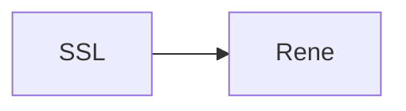

### 16. Database credential rotation
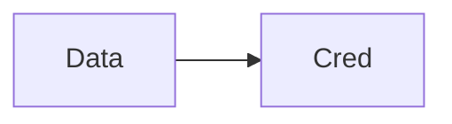

### 17. Node cordoning and draining
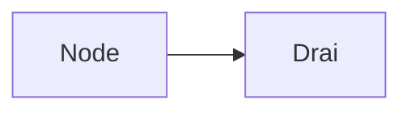

### 18. Auto-scaling group manipulation
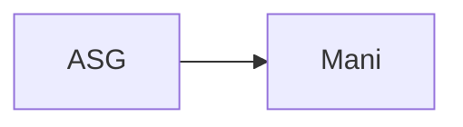

### 19. WAF rule IP block execution
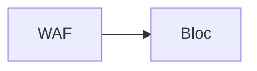

### 20. Synthetic test failure handling
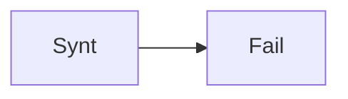

### 21. SLO breach notification
```mermaid
graph LR
    S[SLO] --> B[Brea]
```

### 22. GitOps sync force trigger
```mermaid
graph LR
    G[GitO] --> F[Forc]
```

### 23. Chaos engineering experiment
```mermaid
graph LR
    C[Chao] --> E[Expe]
```

### 24. Audit log archival
```mermaid
graph LR
    A[Audi] --> A[Arch]
```

### 25. Terraform state unlock
```mermaid
graph LR
    T[Terr] --> U[Unlo]
```

### 26. Dead letter queue replay
```mermaid
graph LR
    D[DLQ] --> R[Repl]
```

### 27. ElasticSearch index rollover
```mermaid
graph LR
    E[Elas] --> R[Roll]
```

### 28. Redis cache flush automation
```mermaid
graph LR
    R[Redi] --> F[Flus]
```

### 29. User access revocation
```mermaid
graph LR
    U[User] --> R[Revo]
```

### 30. Executive status page update
```mermaid
graph LR
    E[Exec] --> S[Stat]
```

### 31. Infrastructure: Ops Cluster
```mermaid
graph LR
    I[Infr] --> O[OpsC]
```

### 32. Infrastructure: Postgres DB
```mermaid
graph LR
    I[Infr] --> P[Post]
```

### 33. Infrastructure: Redis Queue
```mermaid
graph LR
    I[Infr] --> R[Redi]
```

### 34. Infrastructure: Bastion Host
```mermaid
graph LR
    I[Infr] --> B[Bast]
```

### 35. Worker: Incident router
```mermaid
graph LR
    W[Work] --> I[Inci]
```

### 36. Worker: Runbook executor
```mermaid
graph LR
    W[Work] --> R[Runb]
```

### 37. Worker: Governance checker
```mermaid
graph LR
    W[Work] --> G[Govn]
```

### 38. CI/CD: Runbook testing
```mermaid
graph LR
    C[CICD] --> R[Runb]
```

### 39. CI/CD: Platform deployment
```mermaid
graph LR
    C[CICD] --> P[Plat]
```

### 40. API: Trigger runbook
```mermaid
graph LR
    A[API] --> T[Trig]
```

### 41. API: List incidents
```mermaid
graph LR
    A[API] --> L[List]
```

### 42. Frontend: Runbook UI
```mermaid
graph LR
    F[Fron] --> R[Runb]
```

### 43. Frontend: Incident board
```mermaid
graph LR
    F[Fron] --> I[Inci]
```

### 44. Security: JIT access request
```mermaid
graph LR
    S[Secu] --> J[JIT]
```

### 45. Security: Credential injection
```mermaid
graph LR
    S[Secu] --> C[Cred]
```

### 46. Integration: PagerDuty sync
```mermaid
graph LR
    I[Inte] --> P[PD]
```

### 47. Integration: Jira ticket sync
```mermaid
graph LR
    I[Inte] --> J[Jira]
```

### 48. Integration: ServiceNow CMDB
```mermaid
graph LR
    I[Inte] --> S[SNOW]
```

### 49. Custom script repository
```mermaid
graph LR
    C[Cust] --> S[Scri]
```

### 50. Parameterized runbook inputs
```mermaid
graph LR
    P[Para] --> I[Inpu]
```

### 51. Multi-step workflow orchestration
```mermaid
graph LR
    M[Mult] --> W[Work]
```

### 52. Dry-run mode execution
```mermaid
graph LR
    D[DryR] --> M[Mode]
```

### 53. Output log streaming
```mermaid
graph LR
    O[Outp] --> S[Stre]
```

### 54. Runbook execution timeout
```mermaid
graph LR
    R[Runb] --> T[Time]
```

### 55. Retry logic & backoff
```mermaid
graph LR
    R[Retr] --> B[Back]
```

### 56. Approval gate pauses
```mermaid
graph LR
    A[Appr] --> G[Gate]
```

### 57. Post-execution validation
```mermaid
graph LR
    P[Post] --> V[Vali]
```

### 58. Webhook callback triggers
```mermaid
graph LR
    W[Webh] --> T[Trig]
```

### 59. Automated RCA generation
```mermaid
graph LR
    A[Auto] --> R[RCA]
```

### 60. Incident timeline extraction
```mermaid
graph LR
    I[Inci] --> T[Time]
```

### 61. Slack transcript archival
```mermaid
graph LR
    S[Slac] --> A[Arch]
```

### 62. On-call handover summary
```mermaid
graph LR
    O[OnCa] --> H[Hand]
```

### 63. Executive summary export
```mermaid
graph LR
    E[Exec] --> S[Summ]
```

### 64. Action item tracking
```mermaid
graph LR
    A[Acti] --> T[Trac]
```

### 65. Blameless culture metrics
```mermaid
graph LR
    B[Blam] --> M[Metr]
```

### 66. Mean Time to Acknowledge (MTTA)
```mermaid
graph LR
    M[MTTA] --> T[Trac]
```

### 67. Mean Time to Resolve (MTTR)
```mermaid
graph LR
    M[MTTR] --> T[Trac]
```

### 68. Alert fatigue analysis
```mermaid
graph LR
    A[Aler] --> F[Fati]
```

### 69. Runbook success rate tracking
```mermaid
graph LR
    R[Runb] --> S[Succ]
```

### 70. Auto-remediation ROI calculation
```mermaid
graph LR
    A[Auto] --> R[ROI]
```

### 71. Tagging policy enforcement
```mermaid
graph LR
    T[Tagg] --> P[Poli]
```

### 72. IAM permission boundary audit
```mermaid
graph LR
    I[IAM] --> B[Boun]
```

### 73. Public S3 bucket detection
```mermaid
graph LR
    P[Publ] --> S[S3]
```

### 74. Security group drift correction
```mermaid
graph LR
    S[SecG] --> D[Drif]
```

### 75. Untagged resource termination
```mermaid
graph LR
    U[Unta] --> T[Term]
```

### 76. Secret rotation validation
```mermaid
graph LR
    S[Secr] --> R[Rota]
```

### 77. Image vulnerability response
```mermaid
graph LR
    I[Imag] --> V[Vuln]
```

### 78. Out-of-band change detection
```mermaid
graph LR
    O[OOB] --> C[Chan]
```

### 79. Platform version matrix validation
```mermaid
graph LR
    P[Plat] --> V[Vers]
```

### 80. Enterprise Operations Maturity
```mermaid
graph LR
    E[Entr] --> O[OpsM]
```

---

## 🛠️ Technical Stack & Implementation

### Operations Engine & APIs
- **Framework**: Python 3.11+ / FastAPI.
- **Runbook Engine**: Python executing dynamic scripts, utilizing Terraform/Ansible SDKs.
- **Persistence**: PostgreSQL (Audit logs, incident state, runbook definitions).
- **Task Orchestration**: Redis & Celery (Asynchronous runbook execution & alert queuing).

### Frontend (Operations Command Center)
- **Framework**: React 18 / Vite.
- **Visuals**: Recharts (Incident Trends).
- **Theme**: Dark, Blue, Emerald (Calm, Operational focus).

### Infrastructure
- **Runtime**: AWS EKS (Dedicated highly-available cluster, separate from product workloads).
- **IaC**: Terraform.
- **Access**: Secure OIDC integration ensuring operators have no standing SSH access to product nodes.

---

## 🚀 Deployment Guide

### Local Development
```bash
# Clone the repository
git clone https://github.com/devopstrio/operations-landingzone.git
cd operations-landingzone

# Setup environment
cp .env.example .env

# Launch the operations stack (DB, Redis, API, Workers, UI)
make up

# Simulate a P1 incident and auto-remediation workflow
make simulate-incident
```
Access the Operations Dashboard at `http://localhost:3000`.

---

## 📜 License
Distributed under the MIT License. See `LICENSE` for more information.
