<div align="center">


<h1>Operations Landing Zone Platform</h1>

<p><strong>The Institutional Command Center for SRE Automation, Incident Response, and Unified Service Management Governance.</strong></p>

[]()
[]()
[]()

<br/>

> **"Hope is not a strategy. Automation is."** 
> **Operations Landing Zone** is an enterprise-grade platform designed to provide a secure, measurable, and highly automated foundation for global service management. It orchestrates the complex lifecycle of infrastructure operations—from real-time monitoring and anomaly detection to automated self-healing remediation and unified incident governance.

</div>

---

## 🏛️ Executive Summary

Fragmented operational tools and manual incident response procedures are strategic operational liabilities; lack of a centralized operations plane is a primary barrier to organizational reliability. Organizations fail to maintain high availability not because of a lack of talent, but because of fragmented monitoring standards, lack of automated runbooks, and an inability to orchestrate remediation with operational precision.

This platform provides the **Operations Intelligence Plane**. It implements a complete **Enterprise Operations-as-Code Framework**, enabling SRE and Platform teams to manage service reliability as a first-class citizen. By automating the detection of service degradation and orchestrating real-time self-healing workflows, we ensure that every organizational asset—from global API gateways to backend database clusters—is monitored by default, resilient to failure, and strictly aligned with institutional availability SLAs.

---

## 📐 Architecture Storytelling: Principal Reference Models

### 1. Principal Architecture: Global Operations Landing Zone & Service Management Control Plane
This diagram illustrates the end-to-end flow from multi-cloud telemetry ingestion and AIOps analysis to automated remediation, incident escalation, and institutional operations auditing.

```mermaid
graph LR
    %% Subgraph Definitions
    subgraph TelemetryIngress["Telemetry & Signal Ingress"]
        direction TB
        Logs["Log Streams (ELK/Splunk)"]
        Metrics["Metric Feeds (Prometheus)"]
        Traces["Distributed Traces (OTel)"]
    end

    subgraph IntelligenceEngine["Operations Intelligence Hub"]
        direction TB
        API["FastAPI Operations Gateway"]
        AIOps["Anomaly & Noise Reducer"]
        Remediator["Self-Healing Orchestrator"]
        Escalator["Incident & SLA Manager"]
    end

    subgraph ExecutionPlane["Automated Remediation Fleet"]
        direction TB
        Runbook["Python/Ansible Runbooks"]
        HPA["Auto-Scaling Controllers"]
        Restart["Self-Healing Workers"]
    end

    subgraph OperationsHub["Institutional Operations Hub"]
        direction TB
        Scorecard["Ops Maturity Scorecard"]
        Analytics["Availability & MTTR Stats"]
        Audit["Forensic Ops Metadata Lake"]
    end

    subgraph DevOps["Operations-as-Code Orchestration"]
        direction TB
        TF["Terraform Ops Modules"]
        ITSM["ITSM Integration (ServiceNow)"]
        ChatOps["ChatOps (Slack/Teams)"]
    end

    %% Flow Arrows
    TelemetryIngress -->|1. Ingest Signals| API
    API -->|2. Detect Anomaly| AIOps
    AIOps -->|3. Trigger Remediation| Remediator
    Remediator -->|4. Execute Fix| Runbook
    
    Runbook -->|5. Apply Patch| ExecutionPlane
    API -->|6. Open Incident| Escalator
    Escalator -->|7. Notify Team| ChatOps
    
    API -->|8. Visualize Health| Scorecard
    Scorecard -->|9. Track MTTR| Analytics
    Scorecard -->|10. Record Event| Audit
    
    TF -->|11. Provision Hub| IntelligenceEngine
    ITSM -->|12. Sync Ticket| Escalator
    Audit -->|13. Improve Runbooks| Remediator

    %% Styling
    classDef ingress fill:#f5f5f5,stroke:#616161,stroke-width:2px;
    classDef intel fill:#e1f5fe,stroke:#01579b,stroke-width:2px;
    classDef execution fill:#ede7f6,stroke:#311b92,stroke-width:2px;
    classDef ops fill:#e0f2f1,stroke:#004d40,stroke-width:2px;
    classDef devops fill:#fffde7,stroke:#f57f17,stroke-width:2px;

    class TelemetryIngress ingress;
    class IntelligenceEngine intel;
    class ExecutionPlane execution;
    class OperationsHub ops;
    class DevOps devops;
```

### 2. The Operations Lifecycle Flow
The continuous path of an operational event from initial monitoring and analysis to active remediation, automation, and forensic auditing.

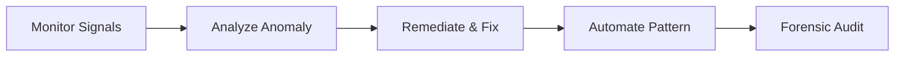

### 3. Hub-and-Spoke Monitoring Topology
Strategic centralization of log aggregation and metric long-term storage in a "Hub" network, with collectors in "Spoke" environments providing isolated telemetry gathering.

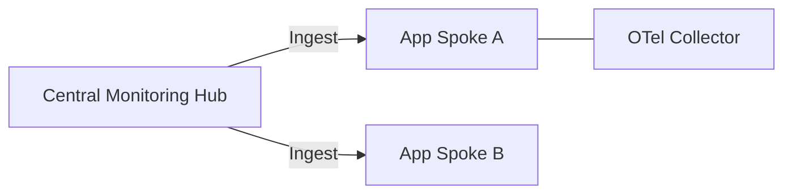

### 4. AIOps & Intelligence Engine Flow
Using real-time machine learning to reduce alert noise, cluster related signals into single incidents, and predict potential failures before they impact end users.

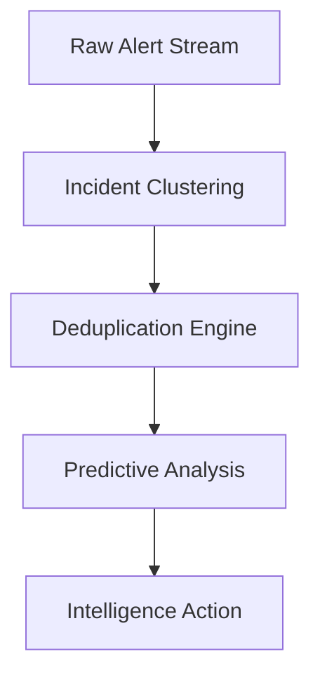

### 5. Self-Healing & Remediation Orchestration
Automatically responding to common infrastructure failures (e.g., Disk Full, Pod Crash) by triggering pre-validated runbooks and infrastructure-as-code updates.

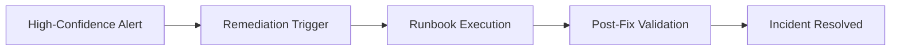

### 6. Incident Management & Escalation Flow
Orchestrating the integration between real-time observability signals and institutional ITSM platforms (ServiceNow, Jira) to ensure compliant incident tracking.

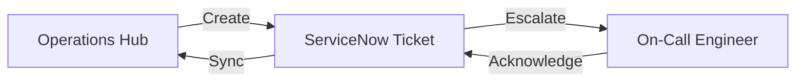

### 7. Institutional Operations Scorecard
Grading organizational performance based on key indicators: Service Availability (SLAs), Mean Time to Recovery (MTTR), and Operational Cost Efficiency.

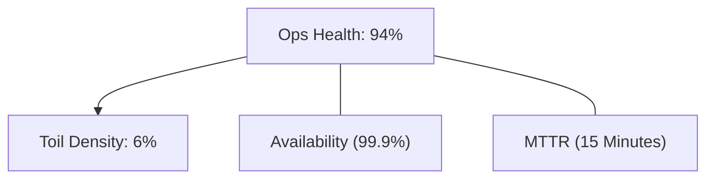

### 8. Identity & RBAC for Ops Governance
Managing fine-grained access to remediation runbooks, infrastructure consoles, and audit logs between Platform Ops, SREs, and Incident Responders.

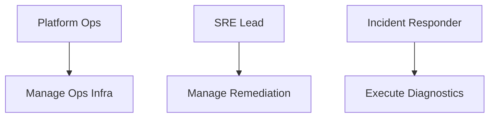

### 9. IaC Deployment: Operations-as-Code Framework
Using modular Terraform to deploy and manage the versioned distribution of the operations hubs, monitoring collectors, and automated remediation workers.

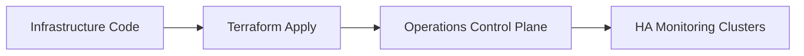

### 10. Log Aggregation & Forensic Sink Mesh
Centralizing global telemetry logs into high-durability, searchable storage for long-term forensic analysis, compliance auditing, and threat hunting.

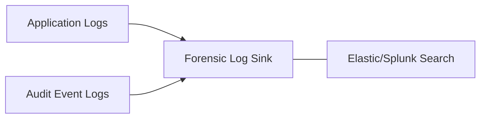

### 11. Metadata Lake for Forensic Operations Audit
Storing long-term records of every alert, remediation action, incident timeline, and system state change for institutional record-keeping and post-mortems.

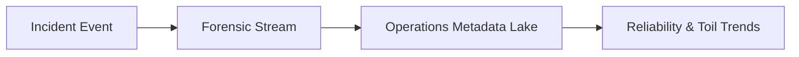

---

## 🏛️ Core Operations Pillars

1.  **Observability-First Design**: Implementing comprehensive logging, metrics, and tracing as a foundational requirement.
2.  **Automated Self-Healing**: Shifting from manual "Toil" to event-driven remediation for high-confidence failures.
3.  **AIOps Intelligence**: Reducing operational noise and accelerating root-cause analysis through automated signal clustering.
4.  **Unified Incident Governance**: Orchestrating a single source of truth for all operational events across the enterprise.
5.  **Runbook-as-Code Framework**: Managing operational procedures as version-controlled, executable code.
6.  **Full Operational Auditability**: Immutable recording of every remediation action and system change for institutional forensics.

---

## 🛠️ Technical Stack & Implementation

### Operations Engine & APIs
*   **Framework**: Python 3.11+ / FastAPI.
*   **Remediation Core**: Integration with Celery/Redis for high-performance, asynchronous runbook execution.
*   **Observability Bridge**: Native integration with Prometheus, Loki, and OpenTelemetry.
*   **Persistence**: PostgreSQL (Incident State & Metadata) and Redis (Live Alert Queue).
*   **Auth Orchestrator**: Federated OIDC/SAML for least-privilege operational access.

### Operations Dashboard (UI)
*   **Framework**: React 18 / Vite.
*   **Theme**: Dark, Blue, Emerald (Modern calm operational aesthetic).
*   **Visualization**: Recharts for incident trends, MTTR analytics, and service health heatmaps.

### Infrastructure & DevOps
*   **Runtime**: AWS EKS or Azure Kubernetes Service (AKS).
*   **Connectivity**: Hub-and-Spoke monitoring transit with integrated Private Link for telemetry.
*   **IaC**: Modular Terraform for deploying the operations hub and collector distributions.

---

## 🏗️ IaC Mapping (Module Structure)

| Module | Purpose | Real Services |
| :--- | :--- | :--- |
| **`infrastructure/ops_hub`** | Central management plane | EKS, PostgreSQL, Redis |
| **`infrastructure/monitoring`** | Telemetry collectors | Prometheus, OTel, Loki |
| **`infrastructure/automation`** | Remediation workers | Celery, Python, Ansible |
| **`infrastructure/auditing`** | Forensic metadata sinks | S3, Athena, Quicksight |

---

## 🚀 Deployment Guide

### Local Principal Environment
```bash
# Clone the operations platform
git clone https://github.com/devopstrio/operations-landingzone.git
cd operations-landingzone

# Configure environment
cp .env.example .env

# Launch the Operations stack
make init

# Trigger a mock P1 incident and auto-remediation simulation
make simulate-incident
```

Access the Operations Dashboard at `http://localhost:3000`.

---

## 📜 License
Distributed under the MIT License. See `LICENSE` for more information.

---
<div align="center">
  <p>© 2026 Devopstrio. All rights reserved.</p>
</div>
